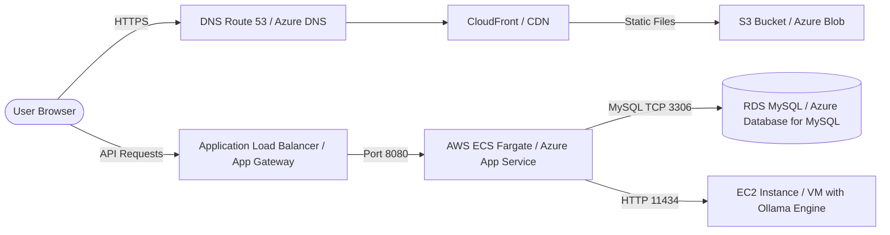

# Antigravity Platform - AWS & Azure Deployment Guide

This guide outlines the production-ready infrastructure deployment strategies for the Antigravity platform on both Amazon Web Services (AWS) and Microsoft Azure.

---

## Deployment Architecture Overview



---

## 1. AWS Deployment Guide (Fargate & RDS)

This strategy utilizes serverless container hosting (AWS Fargate) to scale the API and static website hosting (S3 + CloudFront) for high-availability frontend access.

### Step 1: Database Setup (Amazon RDS MySQL)
1. Create a MySQL DB Instance in a Private Subnet using **Amazon RDS**.
2. Select MySQL 8.0 Engine, Multi-AZ deployment (for production high-availability).
3. Configure Security Groups to allow incoming traffic only on Port `3306` from the ECS Task Security Group.

### Step 2: Storage & CDN (Amazon S3 & CloudFront)
1. Build the Angular app locally: `npm run build`.
2. Upload the contents of `dist/antigravity/browser/` to an **Amazon S3** bucket configured for static web hosting.
3. Configure an **Amazon CloudFront** distribution pointing to the S3 bucket to ensure low-latency HTTPS access with custom SSL certificates (AWS Certificate Manager).

### Step 3: Container Hosting (AWS ECS Fargate)
1. Push the backend Docker image to **AWS ECR** (Elastic Container Registry).
2. Create an **ECS Cluster** using the Fargate (Serverless) launch type.
3. Define a **Task Definition** for the `antigravity-backend` container:
   - Target port: `8080`.
   - CPU/Memory allocation: 0.5 vCPU / 1GB RAM (standard starting scale).
   - Inject environment variables (`ConnectionStrings__DefaultConnection`, `Jwt__Secret`, `Ollama__BaseUrl`).
4. Set up an **Application Load Balancer (ALB)** mapping SSL Port `443` to target group port `8080`.

---

## 2. Azure Deployment Guide (App Services & Container Registry)

This strategy deploys containerized applications directly using Azure App Services and Azure Database for MySQL.

### Step 1: Database Setup (Azure Database for MySQL Flexible Server)
1. Deploy an **Azure Database for MySQL Flexible Server**.
2. Configure networking to restrict access to the database using Virtual Network (VNet) Integration, allowing connections only from the backend app subnets.
3. Create database `antigravity_db`.

### Step 2: Container Registry & Web App (ACR & App Services)
1. Create an **Azure Container Registry (ACR)** instance.
2. Build and push backend and frontend images to ACR:
   ```bash
   az acr build --registry antigravityregistry --image antigravity-backend:latest ./Antigravity.Backend
   az acr build --registry antigravityregistry --image antigravity-frontend:latest ./Antigravity.Frontend
   ```
3. Deploy two **Azure Web App for Containers** resources:
   - `antigravity-api`: Serves the backend image from ACR. Configure App Settings to bind Connection Strings and JWT Secrets.
   - `antigravity-web`: Serves the frontend Nginx image from ACR.
4. Set up **VNet Integration** on the backend App Service to securely access the MySQL database server.

---

## 3. GitHub Actions CI/CD Pipeline

Automate builds and deployments to AWS using the following workflow template:

```yaml
name: Deploy Antigravity Backend to AWS ECR/ECS

on:
  push:
    branches: [ "main" ]

jobs:
  deploy:
    runs-on: ubuntu-latest
    steps:
    - name: Checkout Code
      uses: actions/checkout@v3

    - name: Configure AWS Credentials
      uses: aws-actions/configure-aws-credentials@v1
      with:
        aws-access-key-id: ${{ secrets.AWS_ACCESS_KEY_ID }}
        aws-secret-access-key: ${{ secrets.AWS_SECRET_ACCESS_KEY }}
        aws-region: us-east-1

    - name: Login to Amazon ECR
      id: login-ecr
      uses: aws-actions/amazon-ecr-login@v1

    - name: Build, tag, and push image to Amazon ECR
      env:
        ECR_REGISTRY: ${{ steps.login-ecr.outputs.registry }}
        ECR_REPOSITORY: antigravity-backend
        IMAGE_TAG: ${{ github.sha }}
      run: |
        docker build -t $ECR_REGISTRY/$ECR_REPOSITORY:$IMAGE_TAG -t $ECR_REGISTRY/$ECR_REPOSITORY:latest ./Antigravity.Backend
        docker push $ECR_REGISTRY/$ECR_REPOSITORY:$IMAGE_TAG
        docker push $ECR_REGISTRY/$ECR_REPOSITORY:latest
```
